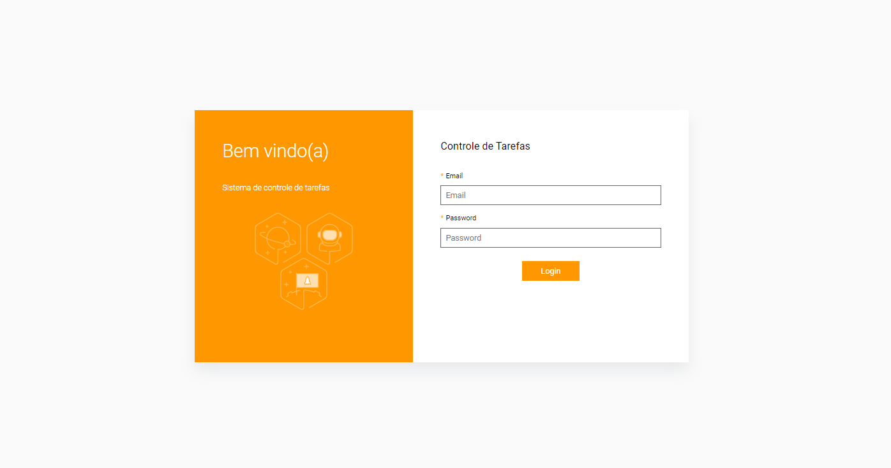
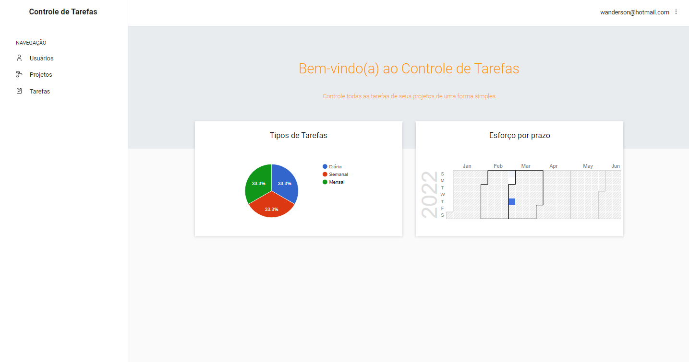
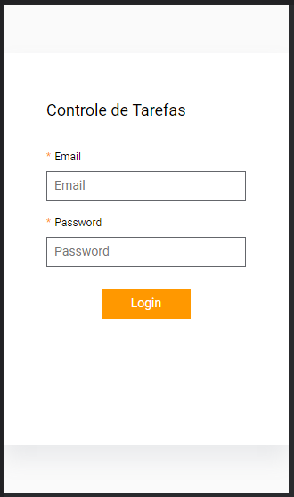

<h1 align="center">
  Gerenciamento de Projetos e Tarefas
</h1>

<div align="center">
  <a href="#-projeto">Projeto</a>&nbsp;&nbsp;&nbsp;|&nbsp;&nbsp;&nbsp;
  <a href="#-tecnologias">Tecnologias</a>&nbsp;&nbsp;&nbsp;|&nbsp;&nbsp;&nbsp;
  <a href="#-layout">Layout</a>&nbsp;&nbsp;&nbsp;|&nbsp;&nbsp;&nbsp;
  <a href="#-layout">Licença</a>&nbsp;&nbsp;&nbsp;|&nbsp;&nbsp;&nbsp;
  <a href="#-layout">Autor</a>
</div>

<br> 

<p align="center">
  
  
  
</p>

<br>

## 💻 Projeto

O sistema consiste em um Gerenciamento de Projetos e Tarefas, onde poderá ser criado vários projetos com suas tarefas e atribuí-las a um coloborador específico ou para vários colaboradores. Também tem armazenamento de arquivos em nuvem na Amazon S3.<br>
<br>
O sistema possui 3 perfis de acesso, sendo Administrador, Supervisor e Operador, cada um com níveis de acesso diferentes, por exemplo, o perfil Administrador pode realizar todas os operações disponíveis:

**Usuários**
- Cadastrar Usuários;
- Editar/Alterar/Atualizar Usuários;
- Deletar/Excluir Usuários;

**Projetos**
- Cadastrar Projetos;
- Editar/Alterar/Atualizar Projetos;
- Deletar/Excluir Projetos;
- Atribuir um Responsável ao Projeto;

**Tarefas**
- Cadastrar Tarefas;
- Editar/Alterar/Atualizar Tarefas;
- Deletar/Excluir Tarefas;
- Adicionar Imagens a uma Tarefa;
- Atribuir um responsável as Tarefas;

O perfil Supervisor não tem acesso para cadastrar editar ou deletar usuários, sendo liberado o acesso as demais operações, já o perfil operador tem acesso apenas para visualizar os projetos e as tarefas que foram atribuidas a ele, sendo possível encerrar ou excluir uma tarefa, mas não poderá concluir ou excluir um projeto.   
<br>
✨ Se desejar saber um pouco mais de detalhes sobre este projeto assista ao vídeo 

### [Clique aqui](https://www.youtube.com/watch?v=2PhD1E3QsvE&t=135s)

<br>

### Desktop - Tela de Login

<p align="center">
    
</p>

<br>

### Desktop - Tela de Dashboard 

<p align="center">
    
</p>

<br>

### Mobile - Responsividade

<p align="center">
    
</p>
<br>

### Modelagem Entidade Relacionamento

<p align="center">
    
</p>

## 🚀 Tecnologias

Esse projeto foi desenvolvido com as seguintes tecnologias e ferramentas:

- [ReactJS](https://pt-br.reactjs.org/)
- [NodeJS](https://nodejs.org/en/)
- [AdminJS](https://adminjs.co/)
- [Yarn](https://classic.yarnpkg.com/en/)
- [PostgreSQL](https://www.postgresql.org/)
- [Sequelize ORM](https://sequelize.org/)
- [Express](http://expressjs.com/pt-br/)
- [Bcrypt.js](https://www.npmjs.com/package/bcrypt)
- [React Google Charts](https://www.react-google-charts.com/)
- [Lodash](https://lodash.com/)
- [Insomnia](https://insomnia.rest/download)
- [AWS - Amazon S3](https://aws.amazon.com/pt/s3)

<br>

## 🔥 Executar Aplicação

### 🎇 Executando Localmente a Aplicação

Caso você deseja executar o projeto na sua máquina local, você precisará instalar o Node.js e Yarn em sua máquima, após a instalação, basta seguir os passos abaixo:

### 🌀 Começando...

Para começar, você deve simplesmente clonar o repositório do projeto na sua máquina e instalar as dependências.

### ❗️ Instalando as Dependências (via Windows):

Abre o cmd (caso esteja utilizando o Windows) navegue até o local onde você clonou o projeto, exemplo:

```sh
C:\Users\NomeDoComputador\Documents\clonedoprojeto
```

Quando estiver na pasta do projeto, basta acessar a pasta `controle-de-tarefas` abra um terminal dentro desta pasta e digite a seguinte instrução: **(dentro da pasta `controle-de-tarefas` do projeto clonado)**

```sh
yarn install
```

Ao digitar a instrução acima, automaticamente ele irá baixar todas as dependências listadas e definidas no arquivo package.json:

- `node_modules` - que contêm os packages do npm que precisará para o projeto.

Bom, ainda com o terminal **(ainda dentro da pasta `controle-de-tarefas` do projeto clonado)** execute a instrução a seguir:

```sh
yarn dev
```

Pronto! dessa forma o projeto `controle-de-tarefas`  estará rodando localmente em sua maquina, acesse:

```sh
http://localhost:5000/admin
```
Senhas de acesso: <br>
Usuário: admin@admin.com <br>
Senha: secret
<br>
<br>
Usuario: manager@manger.com <br>
Senha: secret
<br>
<br>
Usuario: operator@operator.com <br>
Senha: secret
<br>

## 🚩 Tenho Dúvidas... O que fazer?

Caso tenha dúvidas sobre o código do projeto, sintam-se a vontade em abrir uma **[ISSUE AQUI](https://github.com/Wanderson-A-Timoteo/controle-de-tarefas/issues)**. Assim que possível, responderei todas as dúvidas!

<br>

## 💡 Licença

Esse projeto está sob a licença MIT. Veja o arquivo [LICENSE](.github/LICENSE.md) para mais detalhes.

<br>

## 🎆 Autor:

Feito com ♥ by

-  [**Wanderson A. Timóteo**](https://wanderson.tk)

<br>

## 🤝 Agradecimento


<p align="center">
  
</p>

- Projeto desenvolvido com o conhecimento adquirido pelas aulas da [Dev Samurai](https://devsamurai.com.br/).

- Agradecimento ao [Felipe Fontoura](https://lp.devsamurai.com.br/links/) por compartilhar conteúdo relevante e com qualidade de ensino.
